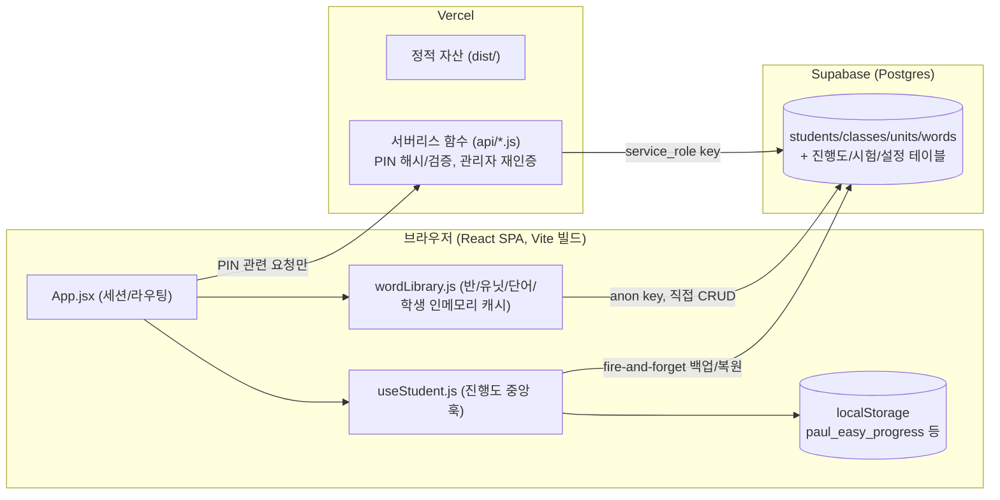

# ARCHITECTURE.md — Paul Easy Voca

_작성: 2026-07-18. 전부 실제 소스(`src/`, `api/`, `scripts/`, `supabase_*.sql`)를 읽고 확인한 내용입니다. `PROJECT_GUIDE.md`에서 여기로 왔다면, 먼저 그 문서의 "헷갈리는 것 Top 5"를 읽고 오는 걸 권장합니다._

## 1. 전체 아키텍처

React 18 SPA + Vercel 서버리스 함수(일부 민감 로직만) + Supabase(Postgres). 전역 상태관리 라이브러리 없음.



- 학생/관리자/학부모용 화면은 전부 같은 SPA(`src/App.jsx`)이며 역할 분기는 클라이언트 라우팅(로그인 화면 vs `showAdmin`/`showParent` state)일 뿐, 별도 서버 라우트가 없습니다.
- Supabase Auth를 쓰지 않습니다 — 학생/관리자 전부 같은 anon key로 접속하고, "누구인지"는 애플리케이션 레벨(이름+PIN, 관리자 PIN)로만 구분합니다. 이 설계 결정이 4번 인증 흐름과 7번 RLS 설계에 그대로 이어집니다.

## 2. 폴더 구조

```
src/
  components/   화면·UI 컴포넌트. PascalCase 파일명, 컴포넌트당 1파일.
                학생 화면(WordDetail/QuizGame/SpellingQuestion/DiaryPage/StudyCalendar/
                미니게임 4종), 관리자(AdminScreen — 탭별 서브컴포넌트 다수 포함,
                FeatureManagementPanel, TestPaperGenerator, EntranceTestAdmin),
                학부모(ParentScreen), 공용(HeroReaction, InAppBrowserNotice)
  hooks/        useStudent.js(진행도 중앙 훅), useMicReady.js, useFeatureAccess.js
  utils/        순수 로직 + Supabase 접근 함수. camelCase.
                wordLibrary.js(반/유닛/단어/학생 CRUD·캐시 — 사실상 "데이터 계층"),
                speech.js(TTS/녹음), spelling.js(채점), weeklyReport.js(리포트 생성),
                entranceTest.js/entranceTestApi.js(입실시험), supabaseClient.js
  config/       features.js(Feature Flag), rbac.js(역할/권한) — 2024-01-01 확장 설계의
                일부만 실제로 살아있음(ARCHITECTURE.md 5번 섹션, PROJECT_GUIDE.md 문서지도 참고)
  data/         정적 데이터. words.js(초기 시드 단어), stickers.js, backgrounds.js
  assets/       이미지 등 정적 자산(paul/ 마스코트 이미지 세트 포함)
api/            Vercel 서버리스 함수. kebab-case 파일명 = URL 경로(예: verify-student-pin.js
                → POST /api/verify-student-pin). `_`로 시작하는 파일(_pinAuth.js)은
                Vercel이 라우트로 취급하지 않는 공용 헬퍼 — 이 프로젝트의 명시적 관례.
scripts/        Node로 직접 실행하는 테스트/운영 스크립트. test*.mjs(회귀 테스트),
                build*Bundle.mjs(esbuild로 실제 src 번들), fakeReact*.mjs(테스트 하네스),
                ops*.mjs(1회성 운영 스크립트). 상세는 TESTING.md.
supabase_*.sql  DB 마이그레이션 파일(버전별, 파일명에 순서 내포). DATABASE.md 참고.
```

## 3. 인증 흐름

두 종류의 완전히 분리된 인증이 있습니다.

**학생 로그인 (이름 + 4자리 PIN, v1.6~v1.7)**
1. `StudentSelect.jsx`에서 이름 선택/입력 → 4자리 PIN 입력.
2. 클라이언트는 PIN을 직접 검증하지 않고 `api/verify-student-pin.js`(서버리스, service_role key)에 위임.
3. 서버는 `students.pin_hash`를 `api/_pinAuth.js`의 `verifyPin()`(Node `crypto.scryptSync` + `timingSafeEqual`, 외부 라이브러리 없음)으로 비교. 5회 연속 실패 시 `pin_fail_count`/`pin_locked_until`로 서버 측 잠금.
4. 신규 학생은 관리자가 `bulk-generate-temp-pins.js`로 임시 PIN을 발급하거나, `pin_setup_allowed`가 true인 학생은 `self-set-student-pin.js`로 최초 1회 자기 PIN을 설정할 수 있음(약한 PIN 10+14종은 `isWeakPin()`으로 서버에서 거부).
5. 성공 시 `App.jsx`가 `localStorage['paulEasyVoca_currentStudent'] = { id, name }`를 저장 — **이름이 아니라 id가 진짜 세션 키**(`PROJECT_GUIDE.md` Top 5 참고).
6. v1.9 SQL 실행 후, PIN 관련 4개 컬럼(`pin_hash`/`pin_fail_count`/`pin_locked_until`/`pin_setup_allowed`)은 anon key로 SELECT/UPDATE 자체가 Postgres 컬럼권한으로 차단됩니다 — 클라이언트 코드가 실수로라도 이 컬럼에 접근할 수 없는 구조.

**관리자 인증 (단일 PIN, 환경변수 `ADMIN_PIN`)**
1. `AdminScreen.jsx` 진입 시 PIN 입력 → `api/verify-admin-pin.js`(또는 로컬 dev의 `vite.config.js` 미들웨어)가 서버에서 `process.env.ADMIN_PIN`과 대조.
2. 통과하면 클라이언트에 `authed=true` state가 생기지만, **파괴적/유출성 액션(PIN 초기화, 임시PIN 일괄발급 등)은 매 요청마다 `checkAdminReauth()`로 서버에서 다시 `ADMIN_PIN`을 확인**합니다 — 클라이언트 state만으로는 그런 API를 호출할 수 없도록 방어(2026-07-16 P7 감사 후속).

학부모 화면은 별도 인증이 없고(기존 학생 이름 조회 방식과 동일한 신뢰 모델), `ParentScreen.jsx`가 조회 전용으로 `fetchDashboardData`만 호출합니다.

## 4. 상태관리

- 전역 스토어(Redux/Zustand/Context API 기반 전역) **없음**. 화면 전환은 `App.jsx`의 로컬 `useState(screen)` 하나로 처리(문자열 스위치: `'dashboard' | 'wordBrowser' | 'wordDetail' | 'quiz' | ...`).
- `hooks/useStudent.js`(1000줄+)가 사실상 진행도의 중앙점입니다 — 별/스티커/미션/캘린더 히스토리/스트릭/다이어리 배치/스펠링 오답노트/유닛별 이어하기 위치/단어별 known-unknown 상태를 전부 이 훅 하나가 소유하고, `App.jsx`가 이를 구조분해해 여러 화면에 prop으로 내려줍니다.
- 반/유닛/단어/학생 로스터는 `useStudent`가 아니라 `utils/wordLibrary.js`의 모듈 스코프 인메모리 캐시(`_cache`/`_students`/`_classSettings`, 아래 5번)가 소유 — "내 진행도"와 "반 전체 데이터"가 의도적으로 서로 다른 계층에 있습니다.

## 5. 캐싱 전략 (`wordLibrary.js`)

모듈 스코프 변수 3개가 사실상의 클라이언트 캐시입니다(React state가 아님 — 컴포넌트 언마운트와 무관하게 탭 수명 동안 유지):

| 캐시 변수 | 채워지는 시점 | 갱신 시점 |
|---|---|---|
| `_cache` (반 이름 → `{ id, units: [...] }`, 단어 포함) | `refreshWordLibrary()` | `initWordLibrary()`(최초 1회, 비어있을 때만) + 앱이 포커스를 되찾을 때(`visibilitychange`/`focus`) |
| `_students` (Map: studentId → `{ name, classId, className, unitName, ... }`) | `refreshStudents()` | 로그인 성공 시(`handleSelect`), 앱 포커스 복귀 시 |
| `_classSettings` (반 이름 → 쓰기시험 설정) | `refreshClassSettings()` | 앱 포커스 복귀 시 |

`App.jsx`의 `useEffect`가 `visibilitychange`/`focus` 두 이벤트를 동시에 구독하며, 두 이벤트가 겹쳐 발생해도(모바일에서 흔함) `inFlight` 가드로 중복 새로고침(불필요한 Supabase 쿼리 6개 중복 호출)을 방지합니다. 이 캐시가 로그인 순간/포커스 복귀 순간에 새로고침되지 않으면 "다른 기기에서 바꾼 반/유닛이 반영 안 되는" 버그로 이어졌던 실제 이력이 있습니다(v1.1 섹션, `ROADMAP.md`).

## 6. 영속성 전략

- **1차: localStorage.** `useStudent.js`가 studentId를 키로 하는 단일 저장소(`paul_easy_progress`)에 매 변경 즉시 write-through. 예전엔 `paulEasyVoca_{name}_{field}` 형태로 흩어져 있었고(`OLD_PREFIX`), 지금은 레거시 마이그레이션 코드로만 남아있습니다.
- **2차: Supabase 백업.** 변경 2초 디바운스 후 `syncStudentProgress()`가 `student_progress.progress_data`(JSON blob 전체)로 fire-and-forget 업로드. 실패해도 로컬 학습 흐름에 영향 없음(콘솔 경고만).
- **복원 게이트(`restoreChecked`).** 신규 기기/PIN 초기화 후 재로그인처럼 로컬이 비어있는 학생은, 클라우드 백업 복원 시도(성공/실패/5초 타임아웃 무관)가 끝날 때까지 `App.jsx`가 Dashboard를 렌더하지 않습니다 — 빈 로컬 레코드가 먼저 그려졌다가 나중에 데이터가 갈아끼워지는 깜빡임/오탐 방지.
- **v2.2 병합 정책 (`mergeProgressRecords`, 최중요 함수).** 여러 기기/탭을 오간 학생의 로컬 스냅샷과 클라우드 백업을 병합할 때 "나중에 저장한 쪽이 이긴다"(last-writer-wins, 통째 덮어쓰기)가 아니라 **필드별로 최대값/합집합**을 취합니다: 별 총합·클리어 수는 max, 스티커·다이어리 배치는 id 기준 합집합, 캘린더 히스토리는 날짜별 병합, `wordStatus`는 최신 갱신시각 기준. 이 정책이 도입되기 전에는 두 기기를 교차로 쓰면 한쪽 진행분이 영구 유실되는 실제 버그가 있었습니다(라이브 재현 확인 후 수정, `handoff.md` 2026-07-17 밤 v2.2 섹션).
- **동시성 가드(2026-07-18 발견·수정).** 디바운스 동기화가 짧은 간격으로 두 번 겹쳐 실행될 때, 먼저 시작한(오래된) 호출의 네트워크 응답이 늦게 도착하면 최신 업로드를 덮어쓸 수 있었던 레이스가 있었음 — `syncGenRef`(세대 카운터)로 "내가 여전히 최신 세대인지" 확인 후에만 업로드하도록 수정됨.
- **알려진 잔여 위험(Medium, 미수정, 의도적 보류).** 같은 기기의 두 탭이 동시에 열려 있으면 `localStorage` write-through 자체는 서로 덮어쓸 수 있음(마지막에 쓴 탭이 로컬 값을 확정) — 단 각 탭이 최소 1회 클라우드 동기화를 마치면 다음 로그인의 병합 복원이 로컬도 수렴시킴. 두 탭 모두 동기화를 한 번도 못 마치고 동시에 닫히는 좁은 창만 유실 위험(초등 공부방 단일기기·단일탭 사용 패턴상 실사용 가능성 낮음으로 판단, 기록만 하고 미수정).

## 7. Supabase 아키텍처

핵심 4테이블(`students`/`classes`/`units`/`words`)이 있고 그 위에 기능별 테이블이 FK로 얹힙니다. 전체 테이블 목록/컬럼은 `DATABASE.md` 참고 — 여기서는 관계와 권한 모델만 요약합니다.

- **관계 골격**: `classes` 1—N `units` 1—N `words`, `classes`/`units` 1—N `students`(v2.1부터 `students.current_unit_id`가 `units.id` 직접 FK, 예전 `unit_name` 문자열은 하위호환용으로 잔존). 진행도류 테이블(`student_progress`, `student_daily_progress`, `word_status` 등)은 전부 `students.id`를 FK로 물고 `on delete cascade`.
- **RLS 대신 컬럼권한(v1.9).** 이 앱은 Supabase Auth가 없어 행 단위로 "누구인지" 구분할 수 없으므로, RLS(행 정책) 대신 `students` 테이블의 PIN 관련 4개 컬럼만 Postgres 컬럼권한(`GRANT`/회수)으로 anon·authenticated에게서 차단했습니다. 나머지 컬럼과 나머지 테이블은 기존처럼 anon key로 전부 CRUD 가능 — "진짜 위협(PIN 자격증명)만 잘라내고 앱을 안 깨뜨리는" 최소침습 설계로 명시돼 있습니다. **주의(운영 함정)**: 이후 마이그레이션에서 `students`에 새 컬럼을 추가하면 테이블 단위 SELECT가 이미 회수된 상태라 `grant select (새컬럼) on students to anon, authenticated;`를 반드시 같이 실행해야 하며, v2.1의 `current_unit_id` 추가 때 이 절차가 실제로 지켜졌음이 확인돼 있습니다.
- **service_role vs anon**: `api/*.js`(서버리스 함수)는 `SUPABASE_SERVICE_ROLE_KEY`(RLS/컬럼권한 우회) 우선 사용, 로컬에 없으면 anon key로 폴백(`_pinAuth.js`의 `supabaseAdminKey()`) — 로컬 개발 시 PIN 관련 서버 스크립트가 v1.9 컬럼권한에 막힐 수 있다는 뜻이기도 합니다. 그 외 클라이언트 코드(`wordLibrary.js` 등)는 전부 `VITE_SUPABASE_ANON_KEY`만 사용.

## 8. 배포 프로세스

1. `git push`(main 브랜치) → Vercel이 자동으로 `npm run build`(`vite build`) 실행 후 배포.
2. DB 스키마 변경은 배포에 포함되지 않습니다 — `supabase_*.sql` 파일은 **운영자가 Supabase 대시보드 SQL Editor에서 수동 실행**해야 합니다(앱 코드는 anon key만 쓰므로 DDL 권한이 없음). 이 저장소의 세션들은 예외 없이 "코드 배포"와 "SQL 적용"을 분리해서 진행하고, 대부분의 마이그레이션은 컬럼 부재를 감지해 안전한 기본값으로 폴백하도록 짜여 있어 SQL 미적용 상태에서도 앱이 깨지지 않게 설계됩니다(각 `supabase_*.sql` 파일 상단 주석에 "이 SQL을 아직 실행하지 않아도 앱은 절대 깨지지 않습니다" 류의 명시가 반복됨).
3. **번들 해시 대조 검증 패턴** — 이 저장소의 세션들이 반복해서 쓰는 배포 확인 방법: 로컬 `npm run build`로 만든 `dist/assets/*.js` 해시 파일명과, 실제 라이브 사이트가 서빙하는 번들 파일명(예: `index-CrCw6LYF.js`)을 대조하고, 그 안에 이번 변경에서만 생기는 고유 문자열(신규 UI 라벨, 신규 함수명 등)이 포함되어 있는지 확인합니다. "push는 했지만 Vercel 배포가 아직 안 끝났거나 실패한" 상황을 로그가 아니라 실제 서빙되는 코드로 확정하기 위한 습관입니다.

## 주요 플로우 (핵심 파일 경로 포함)

**[학생] 로그인** — `StudentSelect.jsx`(이름 선택+PIN 입력) → `api/verify-student-pin.js`(서버 scrypt 대조) → `App.jsx`의 `handleSelect()`가 `refreshStudents()` 후 세션(`{id,name}`) 저장 → `AppInner`가 `useStudent(studentId)`로 진행도 로드, `restoreChecked`가 true가 될 때까지 로딩 화면.

**[학생] 단어 학습(공부하기 모드)** — `WordBrowser.jsx`에서 단어 선택 → `WordDetail.jsx`가 `buildSteps(mode,...)`로 스텝 배열 결정(`study` 모드는 `['pronounce', 'example'?]`) → `PronounceStep`(TTS 재생 + 녹음, `utils/speech.js`) → `ExampleStep`(예문+한글 뜻) → 완료 시 `onMarkViewed`/`onMarkExampleHeard`(`useStudent.js`)로 오늘 기록 갱신.

**[학생] 발음 녹음/듣기** — `PronounceStep`(`WordDetail.jsx`) → `speech.js`의 `recordWithAutoStop()`(무음 자동정지 녹음) → 성공 시 `onMarkPronunciationOk` + `addStars(1)`. 실제 발음 정확도는 채점하지 않음(`blob.size>0`을 "연습 완료"로 취급, `handoff.md`/`PROJECT_IDEAS.md`에 명시된 의도적 설계 — 정밀 STT 채점은 v1.3 백로그).

**[학생] 퀴즈** — `mode='quiz'`(단독) 또는 종합 모드의 `QuizStep`(`WordDetail.jsx`) / `QuizGame.jsx`(홈에서 바로 진입) → 4지선다 정답 시 `onQuizAnswer(wordId, correct)` → `useStudent.js`의 `recordQuizAnswer` → 오답이면 레벨업 미션(`LevelUpMission.jsx`) 대기열에 추가.

**[학생] 쓰기 시험(스펠링)** — 반 설정(`getClassSettings`)이 켜져 있을 때만 노출. `SpellingQuestion.jsx`가 방향(kr2en/en2kr/mixed — v2.0)에 따라 문제 렌더, `utils/spelling.js`로 대소문자/공백 무시 채점 → `App.jsx`의 `handleSpellingAnswer`가 ①`recordSpellingAnswer`(영구 기록) ②`write` 모드면 세션 집계(`writeSessionStats`) ③애매한 오답(영→한인데 한글로 답함)은 `spellingReviewApi.js`로 교사 검토 큐에 fire-and-forget 기록. 오답은 오늘 학습 종료 시 `SpellingReview.jsx`가 맞을 때까지 자동 복습.

**[학생] 듣기 전용 반복재생** — `speech.js`의 `playRepeating()`(취소 가능한 N회 반복 재생 공용 함수, 2026-07-07 Audio Manager 통합 리팩토링으로 도입) — React StrictMode 이중 mount 시 반복재생이 겹쳐 들리던("에코") 버그의 재발 방지 구조.

**[학생] 미니게임/보너스** — 5단어마다 `BonusChoiceScreen.jsx`로 게임 참여 여부 선택 → `pickNextGame()`(`utils/matchGame.js`, 직전 게임 반복 안 함)으로 4종(풍선/낚시/피자/기차) 중 하나 선택, 전부 `MatchGameShell.jsx` 공유 로직.

**[학생] 미션/선물상자/캘린더/다이어리** — 오늘의 미션 4개(단어/예문/퀴즈/발음) 전부 완료 시 `GiftReveal.jsx`(스티커 뽑기) 자동 표시 → `DiaryPage.jsx`에서 받은 스티커를 자유 배치(`placeSticker`/`updatePlacement`/`removePlacement`/`movePlacementLayer`, 전부 `useStudent.js` 소유) → `StudyCalendar.jsx`가 `history[날짜]` 기반 일별 기록 표시(별/스트릭/게임 기록 포함).

**[학생] 입실시험(Entrance Test, v1.8)** — 교사가 관리자 화면에서 반/문항수/방향/제한시간 지정해 시작 → 학생 홈에 `EntranceTestBanner.jsx` 표시 → 응시 화면(`EntranceTest.jsx`, lazy-load)에서 자동 채점 → `submitResultToServer()`로 결과 저장, 반별 랭킹/오늘의 VIP는 이 결과에서 즉시 계산(날짜 바뀌면 자동 리셋).

**[관리자] 반/단어 업로드** — `AdminScreen.jsx`의 Excel/PDF 탭(`ExcelUpload`/`PdfUpload`, `xlsx`/`pdfjs-dist` 사용, React.lazy로 학생 번들에서 분리) → `setClassWords()`(`wordLibrary.js`)로 반영.

**[관리자] 학생/반 관리** — `AdminScreen.jsx`의 학생 관리 탭(반별 그룹핑, 체크박스 일괄 이동, CSV 내보내기) → `setStudentsClassBulk`/`setStudentClass`/`setStudentUnit`(전부 `wordLibrary.js`). "반 미배정" 그룹은 `classId`가 `null`(반 삭제 시 `ON DELETE SET NULL` 결과, 라이브 실측으로 확정된 안전한 동작 — 학생 계정/진행도는 보존됨)인 학생을 잡아냄.

**[관리자] 숙제/날짜별 배정** — 별도 `homework` 테이블 없이 `daily_assignments`(반의 오늘 배정 단어) + `student_daily_progress.categories_completed>=4`(4개 카테고리 다 채우면 "숙제 완료")로 설계 통합. `FutureAssignmentPlanner`로 미래 날짜 미리 배정 가능. 배정이 없으면 유닛 전체 단어로 자동 폴백(`getStudentWords()`).

**[관리자] 대시보드/주간 리포트** — `AdminDashboard`(`AdminScreen.jsx`) + `ParentScreen.jsx`가 동일한 `fetchDashboardData()`(`wordLibrary.js`)와 `computeStudentStats`/`buildWeeklyReport()`(`utils/weeklyReport.js`)를 공유 — 두 화면이 항상 같은 숫자를 보여주도록 로직을 한 곳에 통합한 것이 설계 의도.

**[학부모] 진도 조회** — `ParentScreen.jsx`(읽기 전용, `onBack`만 받음) → `fetchDashboardData([studentId])` 그대로 재사용, 별도 Supabase 쿼리·별도 통계 로직 없음(관리자 대시보드와 동일 소스).

## Word King 관련 확인 결과

`Word King`(또는 "워드킹"/"단어왕") 관련 코드/컴포넌트/스키마/변수명은 저장소 전체(`src/`, `api/`, `scripts/`, `*.sql`, 모든 `.md`/`.js` 계획 문서 포함)를 대소문자 무관 grep으로 확인한 결과 **전혀 존재하지 않습니다.** `ROADMAP.md`/`PROJECT_IDEAS.md`/`ADVANCED_FEATURES.md`에도 이 이름의 기능에 대한 언급이 없습니다 — 미구현이 아니라 애초에 계획 문서에도 등장한 적 없는 기능입니다. 과거 세션에서 "Word King data if already present" 같은 언급이 있었다면 그건 코드/문서 어디에도 흔적을 남기지 않은 구두 논의였던 것으로 보입니다.
